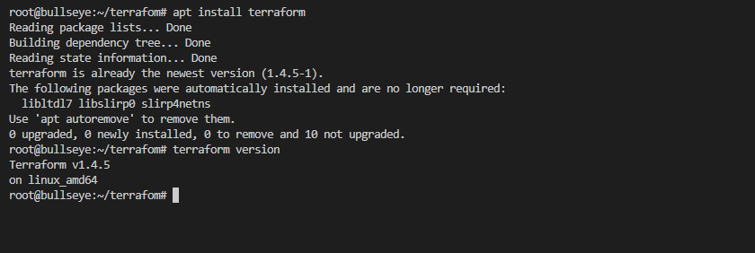

# Домашнее задание к занятию «Terraform»

### Оформление домашнего задания

1. Домашнее задание выполните в [Google Docs](https://docs.google.com/) и отправьте на проверку ссылку на ваш документ в личном кабинете.  
1. В названии файла укажите номер лекции и фамилию студента. Пример названия: 7.2. Terraform — Александр Александров.
1. Перед отправкой проверьте, что доступ для просмотра открыт всем, у кого есть ссылка. Если нужно прикрепить дополнительные ссылки, добавьте их в свой Google Docs.

Любые вопросы по решению задач задавайте в чате учебной группы.

---

### Задание 1

**Ответьте на вопрос в свободной форме.**

Опишите виды подхода к IaC:

 * функциональный:

  Функциональный подход определяет желаемое состояние системы и то, какие ресурсы нужны и какими свойствами они должны обладать, а инструмент IaC поможет настроить его  

 * процедурный;

Процедурный подход определяет конкретные команды, необходимые для достижения желаемой конфигурации. Далее эти команды должны быть выполнены в правильном порядке.  

 * интеллектуальный.

 Интеллектуальный поход является наиболее сложным в описании, так как он указывает, почему инфраструктура должна быть так сконфигурирована.

---

### Задание 2

**Ответьте на вопрос в свободной форме.**

Как вы считаете, в чём преимущество применения Terraform?

Мы можем описать всю необходимую инфраструктуру и оперативно развернуть ее в облаке. Мы можем разворачивать ее при необходимости и удалять при допустим снижении нагрузки на наш сервис. При этом развернутая инфраструктура будет всегда одинакова

---

### Задание 3

**Ответьте на вопрос в свободной форме.**

Какие минусы можно выделить при использовании IaC?

При использовании IaC ошибки могут быть быстро распространены по всем окружениям проекта, поэтому IaC должен быть всесторонне протестирован.
Важно вести документацию чтобы отслеживать изменения в конфигурации инфраструктуры  
 
---

### Задание 4

**Выполните действия и приложите скриншоты запуска команд.**

[Устанавливал по этой инструкции](https://learn.hashicorp.com/tutorials/terraform/install-cli).    

