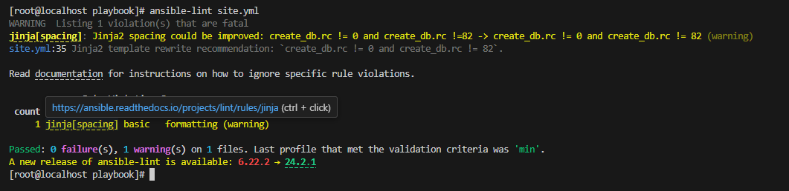
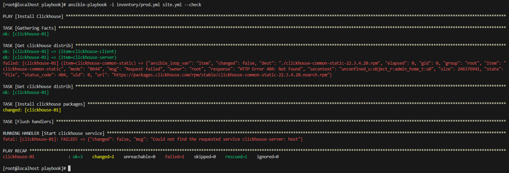
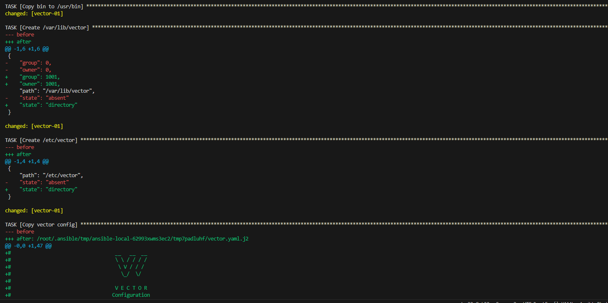
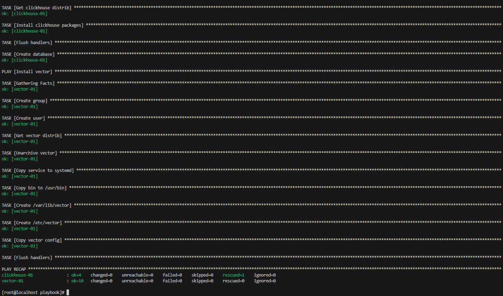

## Playbook [site.yml](./site.yml) 

### Шадрин Алексей

Плейбук поддерживает следующее:

- установка Clickhouse 
- установка Vector весрии 0.36.1 (последняя на текущий момент)

## Настройка

Переменные Clickhouse описаны в /group_vars/clickhouse/vars.yaml

- В clickhouse_version можно указать необходимую версию.
- В clickhouse_packages содержится список пакетов для установки.

Переменные Vector описаны в /group_vars/vector/vars.yaml (На текущий момент файл пуст)

Группы хостов описаны в /inventory/prod.yml

- группа Clickhouse для установки Clickhouse
- группа Vector для установки Vector

Файл templates/vector.yaml.j2 содержит дефолтный конфиг Vector'а

## Установка 

```
ansible-playbook -i inventory/prod.yaml site.yml
```

## Примеры запуска:

### ansible-lint 



### С Флагом --check

*На скриншоте результат запуска плейбука с флагом --check и параметром check-mode: false в таске Get clickhouse distrib. Запуск завершился ошибкой, т.к. таска Install clickhouse packages была запущена в чек мод, пакеты не были установлены и запускать было нечего.*



### С флагом --diff и изменениями




### С флагом --diff без изменений

