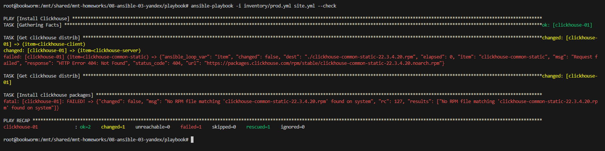

# Домашнее задание к занятию 3 «Работа с Playbook» - Шадрин Алексей

## Основная часть

1. Допишите playbook: нужно сделать ещё один play, который устанавливает и настраивает LightHouse.
2. При создании tasks рекомендую использовать модули: `get_url`, `template`, `yum`, `apt`.
3. Tasks должны: скачать статику LightHouse, установить Nginx или любой другой веб-сервер, настроить его конфиг для открытия LightHouse, запустить веб-сервер.
4. Подготовьте свой inventory-файл `prod.yml`.
5. Запустите `ansible-lint site.yml` и исправьте ошибки, если они есть.

6. Попробуйте запустить playbook на этом окружении с флагом `--check`.

*На скриншоте результат запуска плейбука с флагом --check и параметром check-mode: false в таске Get clickhouse distrib. Запуск завершился ошибкой, т.к. таска Install clickhouse packages была запущена в чек мод, пакеты не были установлены и запускать было нечего.*

7. Запустите playbook на `prod.yml` окружении с флагом `--diff`. Убедитесь, что изменения на системе произведены.

*Скриншот с изменениями*

8. Повторно запустите playbook с флагом `--diff` и убедитесь, что playbook идемпотентен.

*Скриншот, где видно, что изменений нет*

9. Подготовьте README.md-файл по своему playbook. В нём должно быть описано: что делает playbook, какие у него есть параметры и теги. Пример качественной документации ansible playbook по [ссылке](https://github.com/opensearch-project/ansible-playbook). Так же приложите скриншоты выполнения заданий №5-8
10. Готовый playbook выложите в свой репозиторий, поставьте тег `08-ansible-02-playbook` на фиксирующий коммит, в ответ предоставьте ссылку на него.

---

### Как оформить решение задания

Выполненное домашнее задание пришлите в виде ссылки на .md-файл в вашем репозитории.

---
