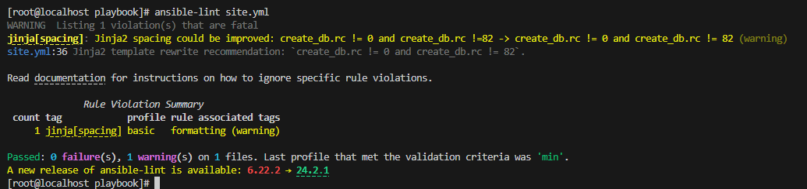
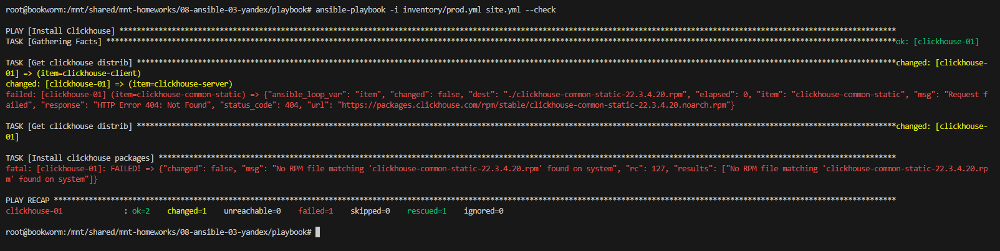
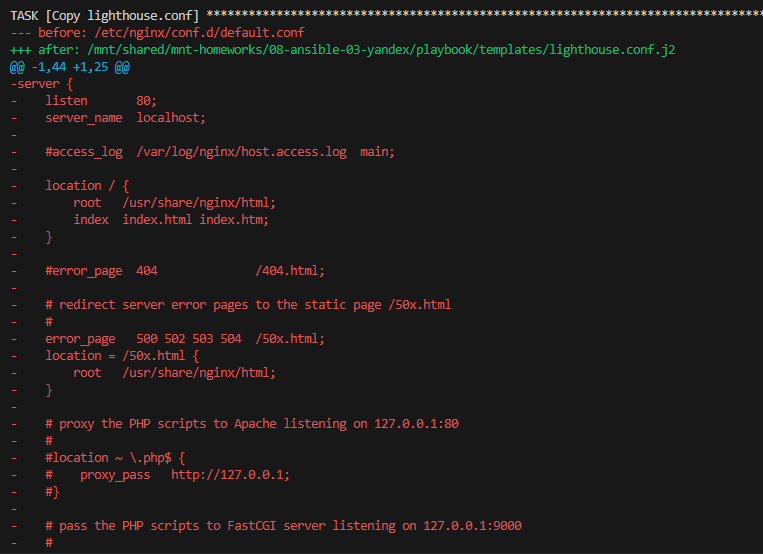
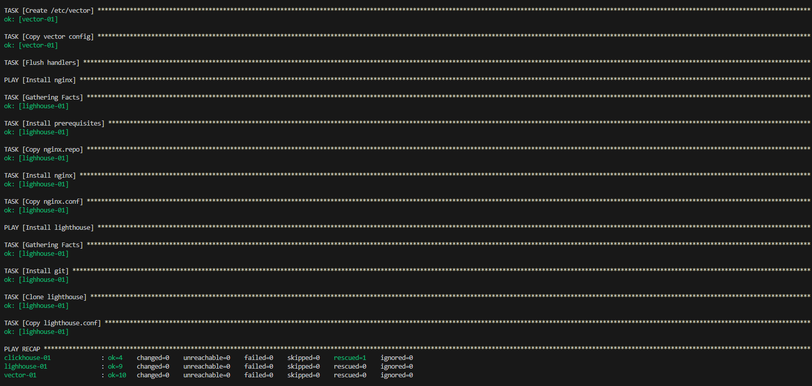

## Playbook [site.yml](./site.yml) 

### Шадрин Алексей

Плейбук поддерживает следующее:

- установка Clickhouse 
- установка Vector весрии 0.36.1 (последняя на текущий момент)
- установка nginx
- установка lighthouse

## Настройка

Переменные Clickhouse описаны в /group_vars/clickhouse/vars.yaml

- В clickhouse_version можно указать необходимую версию.
- В clickhouse_packages содержится список пакетов для установки.

Переменные Vector описаны в /group_vars/vector/vars.yaml (На текущий момент файл пуст)

Переменные Nginx описаны в /group_vars/nginx/vars.yaml (На текущий момент файл пуст)

Переменные Lighthouse описаны в /group_vars/lighthouse/vars.yaml

- В lighthouse_repo - ссылка на репозитарий lighthouse
- В lighthouse_dest - директория, куда будет скопирован lighhouse. 

Группы хостов описаны в /inventory/prod.yml

- группа clickhouse для установки Clickhouse
- группа vector для установки Vector
- группа lighthouse для установки Nginx и Lighthouse

Шаблоны :

- шаблон templates/vector.yaml.j2 содержит дефолтный конфиг Vector
- шаблон templates/nginx.repo.j2 содержит описание репозитария nginx
- шаблон templates/nginx.conf.j2 содержит дефолтный конфиг nginx
- шаблон templates/lighthouse.conf.j2 содержит конфиг lighthouse, в нем так же передается параметр lighthouse_dest

## Установка 

```
ansible-playbook -i inventory/prod.yaml site.yml
```

## Примеры запуска:

### ansible-lint 



### С Флагом --check

*На скриншоте результат запуска плейбука с флагом --check. Запуск завершился ошибкой, т.к. таска Install clickhouse packages была запущена в чек мод, пакеты не были установлены и запускать было нечего.*



### С флагом --diff и изменениями




### С флагом --diff без изменений



### проверка clickhouse


### проверка vector


### проверка lighthouse

