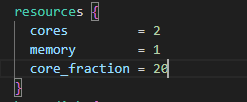
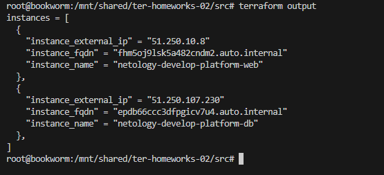

# Домашнее задание к занятию «Основы Terraform. Yandex Cloud» - Шадрин Алексей

[итоговый_код_проекта](./src)

### Задание 1
В качестве ответа всегда полностью прикладывайте ваш terraform-код в git.  Убедитесь что ваша версия **Terraform** =1.5.Х (версия 1.6.Х может вызывать проблемы с Яндекс провайдером) 

1. Изучите проект. В файле variables.tf объявлены переменные для Yandex provider.
2. Создайте сервисный аккаунт и ключ. [service_account_key_file](https://terraform-provider.yandexcloud.net).
3. Сгенерируйте новый или используйте свой текущий ssh-ключ. Запишите его открытую(public) часть в переменную **vms_ssh_public_root_key**.
4. Инициализируйте проект, выполните код. Исправьте намеренно допущенные синтаксические ошибки. Ищите внимательно, посимвольно. Ответьте, в чём заключается их суть.

    4.1 Авторизация по токену, а не ssh-ключу


    4.2 Синтаксическая ошибка standart-standard + у яндекса версии платформ [v1-v3](https://cloud.yandex.ru/ru/docs/compute/concepts/vm-platforms), поменял на standard-v3


    4.3 На версии standard-v3 допустимое количество ядер 2 или 4, и гарантированная доля vcpu = 20, 50 или 100. Поменял на допустимые значения





5. Подключитесь к консоли ВМ через ssh и выполните команду ``` curl ifconfig.me```.
Примечание: К OS ubuntu "out of a box, те из коробки" необходимо подключаться под пользователем ubuntu: ```"ssh ubuntu@vm_ip_address"```. Предварительно убедитесь, что ваш ключ добавлен в ssh-агент: ```eval $(ssh-agent) && ssh-add``` Вы познакомитесь с тем как при создании ВМ создать своего пользователя в блоке metadata в следующей лекции.;


6. Ответьте, как в процессе обучения могут пригодиться параметры ```preemptible = true``` и ```core_fraction=5``` в параметрах ВМ.

*Эти параметры позволяют существенно снизить стоимость вм. Параметр preemtable делает вм прерываемой, и она останавливается либо через 24 часа, либо при нехватке ресурсов для другой вм, у которой этот параметр не указан (в остановленном состоянии она так же потребляет деньги с платежного аккаунта, поэтому ее все равно необходимо удалять). Параметр core_fraction=5 указывает, что вм будет иметь доступ к физическим ядрам как минимум 5% времени — 50 миллисекунд в течение каждой секунды - это также снижает стоимость, но при этом могут появляться задержки в работе, что в целом некритично для учебных задач.*


В качестве решения приложите:

- скриншот ЛК Yandex Cloud с созданной ВМ, где видно внешний ip-адрес;
- скриншот консоли, curl должен отобразить тот же внешний ip-адрес;
- ответы на вопросы.


### Задание 2

1. Замените все хардкод-**значения** для ресурсов **yandex_compute_image** и **yandex_compute_instance** на **отдельные** переменные. К названиям переменных ВМ добавьте в начало префикс **vm_web_** .  Пример: **vm_web_name**.
2. Объявите нужные переменные в файле variables.tf, обязательно указывайте тип переменной. Заполните их **default** прежними значениями из main.tf. 
3. Проверьте terraform plan. Изменений быть не должно. 


### Задание 3

1. Создайте в корне проекта файл 'vms_platform.tf' . Перенесите в него все переменные первой ВМ.
2. Скопируйте блок ресурса и создайте с его помощью вторую ВМ в файле main.tf: **"netology-develop-platform-db"** ,  ```cores  = 2, memory = 2, core_fraction = 20```. Объявите её переменные с префиксом **vm_db_** в том же файле ('vms_platform.tf').  ВМ должна работать в зоне "ru-central1-b"
3. Примените изменения.


### Задание 4

1. Объявите в файле outputs.tf **один** output , содержащий: instance_name, external_ip, fqdn для каждой из ВМ в удобном лично для вас формате.
2. Примените изменения.

В качестве решения приложите вывод значений ip-адресов команды ```terraform output```.



### Задание 5

1. В файле locals.tf опишите в **одном** local-блоке имя каждой ВМ, используйте интерполяцию ${..} с НЕСКОЛЬКИМИ переменными по примеру из лекции.
2. Замените переменные внутри ресурса ВМ на созданные вами local-переменные.
3. Примените изменения.


### Задание 6

1. Вместо использования трёх переменных  ".._cores",".._memory",".._core_fraction" в блоке  resources {...}, объедините их в единую map-переменную **vms_resources** и  внутри неё конфиги обеих ВМ в виде вложенного map.  
   ```
   пример из terraform.tfvars:
   vms_resources = {
     web={
       cores=
       memory=
       core_fraction=
       ...
     },
     db= {
       cores=
       memory=
       core_fraction=
       ...
     }
   }
   ```
3. Создайте и используйте отдельную map переменную для блока metadata, она должна быть общая для всех ваших ВМ.
   ```
   пример из terraform.tfvars:
   metadata = {
     serial-port-enable = 1
     ssh-keys           = "ubuntu:ssh-ed25519 AAAAC..."
   }
   ```  
  
5. Найдите и закоментируйте все, более не используемые переменные проекта.
6. Проверьте terraform plan. Изменений быть не должно.


------

## Дополнительное задание (со звёздочкой*)

**Настоятельно рекомендуем выполнять все задания со звёздочкой.**   
Они помогут глубже разобраться в материале. Задания со звёздочкой дополнительные, не обязательные к выполнению и никак не повлияют на получение вами зачёта по этому домашнему заданию. 


------
### Задание 7*

Изучите содержимое файла console.tf. Откройте terraform console, выполните следующие задания: 

1. Напишите, какой командой можно отобразить **второй** элемент списка test_list.

```
local.test_list[1]
```

2. Найдите длину списка test_list с помощью функции length(<имя переменной>).

```
length(local.test_list)
```

3. Напишите, какой командой можно отобразить значение ключа admin из map test_map.

```
local.test_map.admin
```

4. Напишите interpolation-выражение, результатом которого будет: "John is admin for production server based on OS ubuntu-20-04 with X vcpu, Y ram and Z virtual disks", используйте данные из переменных test_list, test_map, servers и функцию length() для подстановки значений.

```
"${local.test_map.admin} is ${keys(local.test_map)[index(keys(local.test_map), "admin")]} for ${keys(local.servers)[index(keys(local.servers), "production")]} server based on OS ${local.servers.production.image} with ${local.servers.production.cpu} vcpu, ${local.servers.production.ram} ram and ${length(local.servers.production.disks)} virtual disks"
```

**Примечание**: если не догадаетесь как вычленить слово "admin", погуглите: "terraform get keys of map"

В качестве решения предоставьте необходимые команды и их вывод.


------

### Задание 8*
1. Напишите и проверьте переменную test и полное описание ее type в соответствии со значением из terraform.tfvars:
```
test = [
  {
    "dev1" = [
      "ssh -o 'StrictHostKeyChecking=no' ubuntu@62.84.124.117",
      "10.0.1.7",
    ]
  },
  {
    "dev2" = [
      "ssh -o 'StrictHostKeyChecking=no' ubuntu@84.252.140.88",
      "10.0.2.29",
    ]
  },
  {
    "prod1" = [
      "ssh -o 'StrictHostKeyChecking=no' ubuntu@51.250.2.101",
      "10.0.1.30",
    ]
  },
]
```
2. Напишите выражение в terraform console, которое позволит вычленить строку "ssh -o 'StrictHostKeyChecking=no' ubuntu@62.84.124.117"

```
variable "test" {
  type        = list(map(list(string)))
  description = "Список окружений, состоит из мэпов вида env_name = list od string, где list of string - список содержащий строку для подключения по ssh по external_ip и строку с internal_ip"
}
```

```
var.test[0].dev1[0]
```


------

------

### Задание 9*

Используя инструкцию https://cloud.yandex.ru/ru/docs/vpc/operations/create-nat-gateway#tf_1, настройте для ваших ВМ nat_gateway. Для проверки уберите внешний IP адрес (nat=false) у ваших ВМ и проверьте доступ в интернет с ВМ, подключившись к ней через serial console. Для подключения предварительно через ssh измените пароль пользователя: ```sudo passwd ubuntu```


