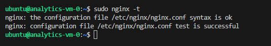
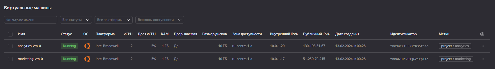
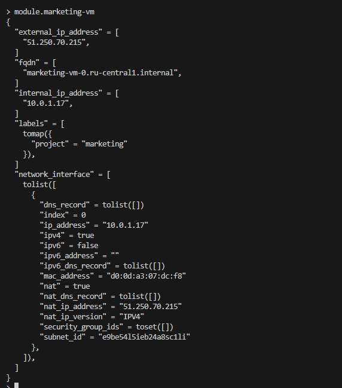
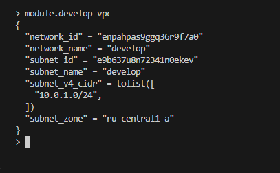
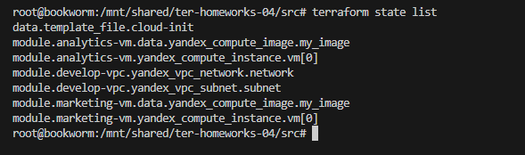
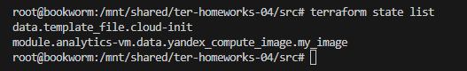
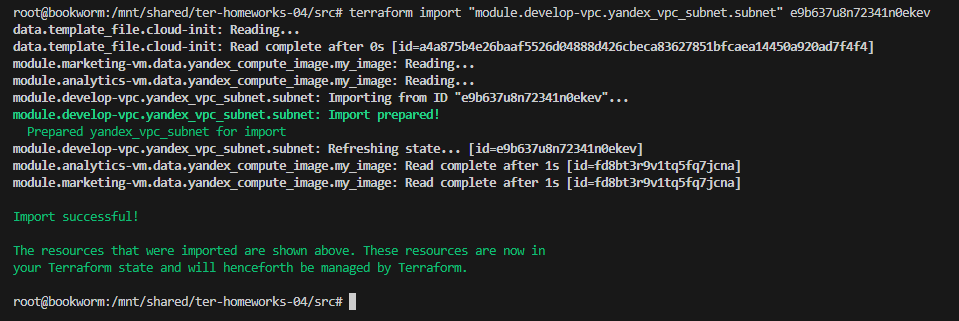
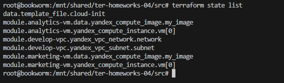
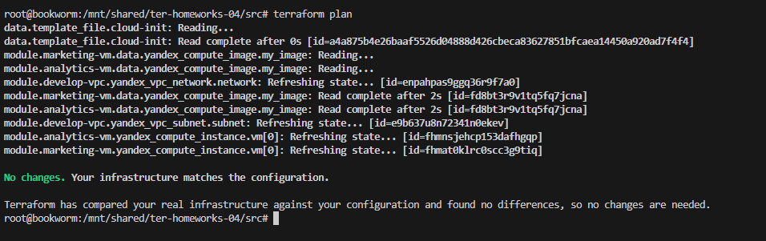

# Домашнее задание к занятию «Продвинутые методы работы с Terraform» - Шадрин Алексей

------

### Задание 1

1. Возьмите из [демонстрации к лекции готовый код](https://github.com/netology-code/ter-homeworks/tree/main/04/demonstration1) для создания с помощью двух вызовов remote-модуля -> двух ВМ, относящихся к разным проектам(marketing и analytics) используйте labels для обозначения принадлежности.  В файле cloud-init.yml необходимо использовать переменную для ssh-ключа вместо хардкода. Передайте ssh-ключ в функцию template_file в блоке vars ={} .
Воспользуйтесь [**примером**](https://grantorchard.com/dynamic-cloudinit-content-with-terraform-file-templates/). Обратите внимание, что ssh-authorized-keys принимает в себя список, а не строку.
3. Добавьте в файл cloud-init.yml установку nginx.
4. Предоставьте скриншот подключения к консоли и вывод команды ```sudo nginx -t```, скриншот консоли ВМ yandex cloud с их метками. Откройте terraform console и предоставьте скриншот содержимого модуля. Пример: > module.marketing_vm

[main.tf - вызов модулей и передача переменных](./src/main.tf)

[config.tf - тут настраиваем шаблон клауд-инита](./src/config.tf)

[cloud-init.yml - шаблон клауд-инита](./src/cloud-init.yml)

[variables.tf - сюда добавил переменные которые пойдут в шаблон](./src/variables.tf)

[locals.tf - тут забираем ssh ключ из файла](./src/locals.tf)









------

### Задание 2

1. Напишите локальный модуль vpc, который будет создавать 2 ресурса: **одну** сеть и **одну** подсеть в зоне, объявленной при вызове модуля, например: ```ru-central1-a```.
2. Вы должны передать в модуль переменные с названием сети, zone и v4_cidr_blocks.
3. Модуль должен возвращать в root module с помощью output информацию о yandex_vpc_subnet. Пришлите скриншот информации из terraform console о своем модуле. Пример: > module.vpc_dev  
4. Замените ресурсы yandex_vpc_network и yandex_vpc_subnet созданным модулем. Не забудьте передать необходимые параметры сети из модуля vpc в модуль с виртуальной машиной.
5. Сгенерируйте документацию к модулю с помощью terraform-docs.
 
Пример вызова

```
module "vpc_dev" {
  source       = "./vpc"
  env_name     = "develop"
  zone = "ru-central1-a"
  cidr = "10.0.1.0/24"
}
```

[main.tf - вызов модулz и передача переменных](./src/main.tf)

[код модуля](./src/vpc)

[документация модуля](./src/vpc/readme.md)




### Задание 3
1. Выведите список ресурсов в стейте.
2. Полностью удалите из стейта модуль vpc.
3. Полностью удалите из стейта модуль vm.
4. Импортируйте всё обратно. Проверьте terraform plan. Изменений быть не должно.
Приложите список выполненных команд и скриншоты процессы.

```
terraform state list
```



```
terraform state rm module.develop-vpc
terraform state rm module.analytics-vm
terraform state rm module.marketing-vm

terraform state list
```




```
terraform import "module.develop-vpc.yandex_vpc_network.network" enpahpas9ggq36r9f7a0
terraform import "module.develop-vpc.yandex_vpc_subnet.subnet" e9b637u8n72341n0ekev
terraform import "module.marketing-vm.yandex_compute_instance.vm[0]" fhmat0klrc0scc3g9tiq
terraform import "module.analytics-vm.yandex_compute_instance.vm[0]" fhmnsjehcp153dafhgqp
```



```
terrafrom state list
```



```
terraform plan
```


