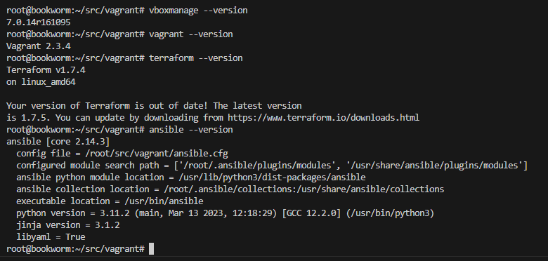
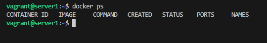

# Домашнее задание к занятию 2. «Применение принципов IaaC в работе с виртуальными машинами» - Шадрин Алексей


## Задача 1

- Опишите основные преимущества применения на практике IaaC-паттернов.

*сокращение стоимости исправления багов за счет их раннего обнаружения, уменьшение time to market*

- Какой из принципов IaaC является основополагающим?

*Идемпотентность*

## Задача 2

- Чем Ansible выгодно отличается от других систем управление конфигурациями?

*Отсутствие агента, ниже порог входа, подходит для управления большинством ОС, т.к. во многих python доступен из коробки*

- Какой, на ваш взгляд, метод работы систем конфигурации более надёжный — push или pull?

*push - возможно из-за того что не работал с pullом, н на мой взгляд надежней написать конфиг, запустить и сразу увидеть, как он отработает на нужных хостах*

## Задача 3

Установите на личный linux-компьютер(или учебную ВМ с linux):

- [VirtualBox](https://www.virtualbox.org/),
- [Vagrant](https://github.com/netology-code/devops-materials), рекомендуем версию 2.3.4(в более старших версиях могут возникать проблемы интеграции с ansible)
- [Terraform](https://github.com/netology-code/devops-materials/blob/master/README.md)  версии 1.5.Х (1.6.х может вызывать проблемы с яндекс-облаком),
- Ansible.



*Приложите вывод команд установленных версий каждой из программ, оформленный в Markdown.*

## Задача 4 

Воспроизведите практическую часть лекции самостоятельно.

- Создайте виртуальную машину.
- Зайдите внутрь ВМ, убедитесь, что Docker установлен с помощью команды
```
docker ps,
```

