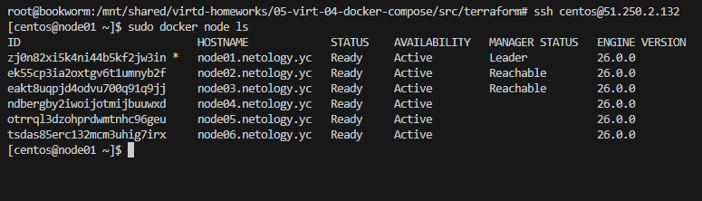
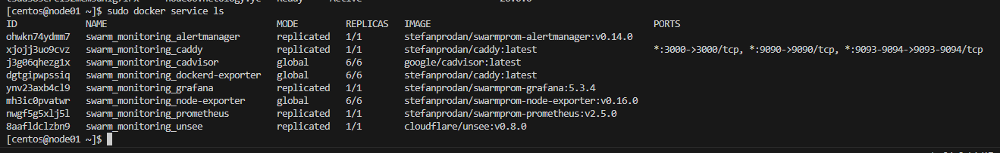

# Домашнее задание к занятию 5. «Оркестрация кластером Docker контейнеров на примере Docker Swarm» - Шадрин Алексей

## Задача 1

Дайте письменые ответы на вопросы:

- В чём отличие режимов работы сервисов в Docker Swarm-кластере: replication и global?

*в режиме global сервис запускается на всех нодах. Если используется режим replication, то указывается количество реплик используемых для сервиса*

- Какой алгоритм выбора лидера используется в Docker Swarm-кластере?

*Docker Swarm кластер использует Raft Consensus Algorithm для того, чтобы гарантировать, что узлы, участвующие в управлении кластером, договариваются о состоянии кластера.*

- Что такое Overlay Network?

*Overlay-сеть создает подсеть, которую могут использовать контейнеры в разных хостах swarm-кластера. Контейнеры на разных физических хостах могут обмениваться данными по overlay-сети (если все они прикреплены к одной сети).*

## Задача 2

Создайте ваш первый Docker Swarm-кластер в Яндекс Облаке.

Чтобы получить зачёт, предоставьте скриншот из терминала (консоли) с выводом команды:
```
docker node ls
```



## Задача 3

Создайте ваш первый, готовый к боевой эксплуатации кластер мониторинга, состоящий из стека микросервисов.

Чтобы получить зачёт, предоставьте скриншот из терминала (консоли), с выводом команды:
```
docker service ls
```


